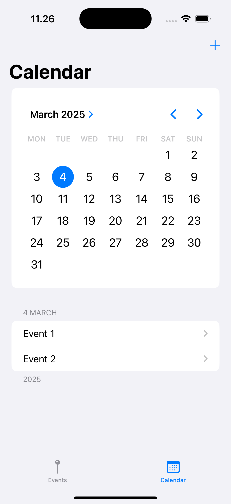
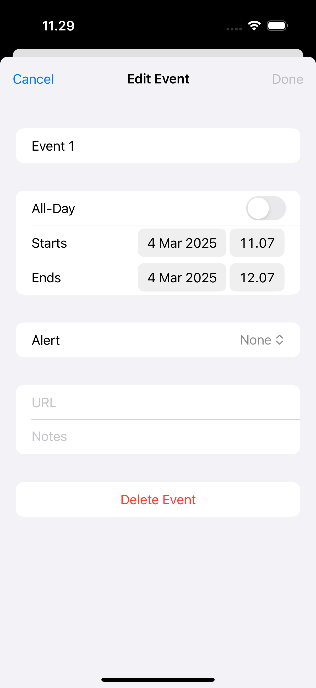
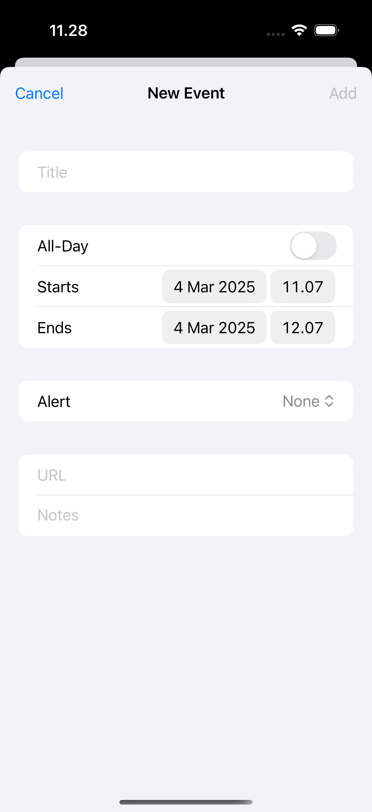
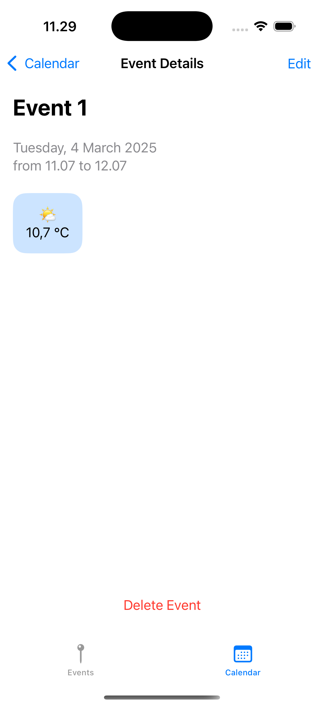

# Calendar App

Welcome to the **Calendar App**! This app helps you efficiently manage your events with a user-friendly interface built using **SwiftUI**. It stores your events locally with **SwiftData** and offers an additional feature by displaying weather information for the event's start date through **DMI's Open Data API**.

## Features

- **Event Management**: Create, edit, and view events with ease.
- **Multiple Views**:
  - **Calendar View**: View all your events in a calendar format.
  - **Events View**: View a detailed list of all events.
  - **New Event View**: Add new events quickly and easily.
  - **Edit Event View**: Modify existing events.
- **Temperature View**: Provides weather data (temperature) for the event's start date using **DMI's Open Data API**.
- **Custom Alert Times**: Set custom alert times for your events.
- **Local Storage**: Events are stored locally using **SwiftData**, making the app fast and efficient.

## Views

### CalendarView
The **CalendarView** displays all your events in a calendar format (day, week, or month view).

- Navigate through months or days using gestures or navigation arrows.
- Tap on any event to open it in the **EditEventView**.



### EventsView
The **EventsView** presents your events in a list format, allowing you to view them chronologically.

- You can quickly access any event’s details or edit them.



### NewEventView
In the **NewEventView**, you can create new events by entering the event title, description, start date, time, and more.

- The view also integrates **TemperatureView**, where it fetches the weather for the event’s start date.



### EditEventView
The **EditEventView** is where you can modify the details of an existing event. You can update the title, description, start date, end date, time, and more.

- Changes are saved automatically or you can cancel the edits if necessary.


### TemperatureView
The **TemperatureView** fetches weather data using **DMI's Open Data API** to show the temperature for the event's start date.

- This is helpful for planning your event based on expected weather conditions.



## Installation

1. Clone the repository:
   ```bash
   git clone https://github.com/yourusername/calendar-app.git

	2.	Open the project in Xcode.
	3.	Build and run the app on the simulator or a connected device.

## Prerequisites

Ensure you have the following:
	•	Xcode (latest stable version)
	•	SwiftUI and SwiftData (iOS 16.0+).

## Usage
	1.	Calendar View: View your events in a calendar format.
	2.	Events View: Browse all your events in a list.
	3.	New Event View: Add new events. The TemperatureView will display the weather forecast for the event’s start date.
	4.	Edit Event View: Modify the details of existing events.

## Technologies Used
	•	SwiftUI: For building the user interface.
	•	SwiftData: For local event data storage and management.
	•	DMI’s Open Data API: For fetching temperature data for the event’s start date.
	•	UserNotifications: To add custom notifications for events.

## API Integration

The TemperatureView integrates with DMI’s Open Data API to fetch weather data based on the event’s start date. The API retrieves temperature information, helping users make informed decisions based on the expected weather.
	•	If temperature data is unavailable, the app will show an alert to inform the user of the issue.
